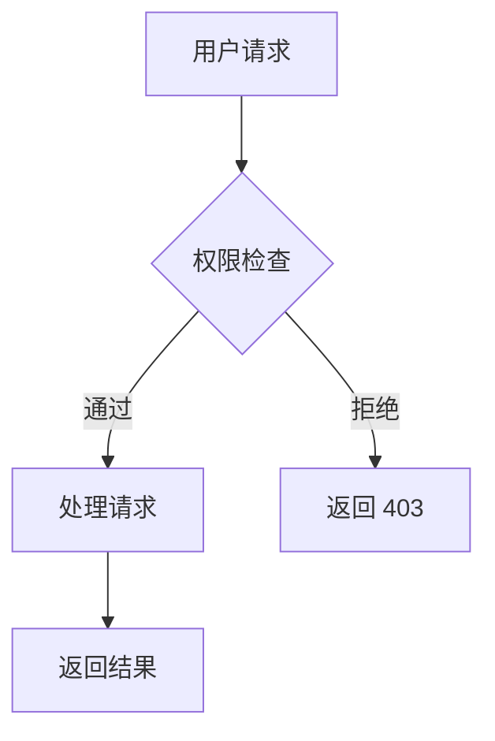
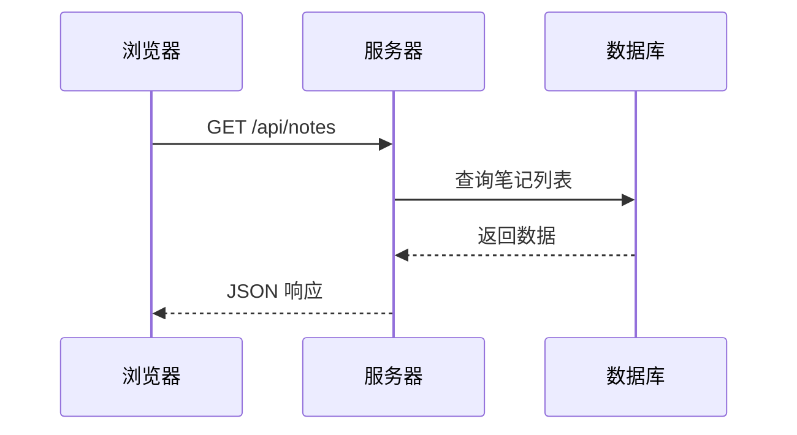
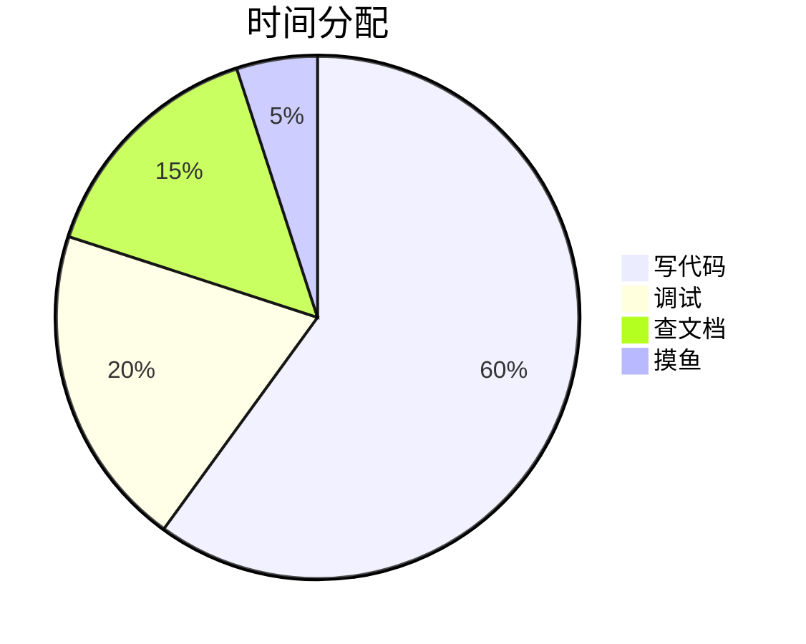

# 启动页 · 笔记写作指南

## 渲染管线

```
原始 Markdown → 脚注提取 → Callout 预处理 → markdown-it（8 插件）→ 后处理（懒加载/外链/语言标签）→ 预览 HTML
                                                                       ↓
                                                              Mermaid 异步二次渲染
```

编辑器左侧写 Markdown，右侧实时预览。每输入一个字立刻渲染。

---

## Markdown 语法速查

### 文本格式

| 写法 | 效果 | 说明 |
|------|------|------|
| `**粗体**` | **粗体** | |
| `*斜体*` | *斜体* | |
| `~~删除线~~` | ~~删除线~~ | 内置，无需插件 |
| `++插入文本++` | <ins>插入文本</ins> | 新增/修订标记 |
| `==高亮==` | ==高亮== | 划重点用 |
| `` `代码` `` | `console.log()` | 行内代码 |
| `H~2~O` | H₂O | 下标 |
| `X^2^` | X² | 上标 |

### 标题

```markdown
# 一级标题 —— 整篇笔记的大标题，通常只有一个
## 二级标题 —— 章节
### 三级标题 —— 小节
#### 四级标题 —— 更细的分段
```

标题在预览中自动带层级样式，一级标题有下划线分隔。

### 列表

无序列表用 `-`，有序用数字，可嵌套：

```markdown
- 买菜
- 洗衣服
  - 深色单独洗
  - 水温不超过 40°C
- 打电话给物业

1. 打开设置
2. 点击「账户」
3. 选择「安全」

- [ ] 还没做的事
- [x] 已经完成的事
- [ ] ~~不做了的事~~
```

任务列表的复选框是只读的，用于展示，不能点击切换。

### 链接

```markdown
[点我访问 GitHub](https://github.com)
[纯链接](https://example.com)
```

外链自动在新标签页打开。

### 图片

```markdown

```

三种方式插入本地图片：

| 方式 | 操作 |
|------|------|
| **粘贴** | 截图后 `Ctrl+V` 直接贴进编辑区 |
| **拖拽** | 从文件夹拖图片文件到编辑区 |
| **工具栏** | 点击上传按钮选择文件 |

上传后自动生成 `` 链接。图片支持 jpg/png/gif/webp。

---

## Emoji 表情速查表

在 Markdown 中用 `:shortcode:` 语法插入 emoji。支持 **1000+** 个短代码，以下是按场景分类的常用项：

### 表情 & 情绪

| 写法 | 效果 | 场景 |
|------|------|------|
| `:smile:` | 😄 | 开心 |
| `:laughing:` | 😆 | 大笑 |
| `:joy:` | 😂 | 笑哭了 |
| `:rofl:` | 🤣 | 笑到打滚 |
| `:smirk:` | 😏 | 坏笑/意味深长 |
| `:wink:` | 😉 | 眨眼 |
| `:blush:` | 😊 | 害羞/暖心 |
| `:heart_eyes:` | 😍 | 好喜欢 |
| `:kissing_heart:` | 😘 | 飞吻 |
| `:stuck_out_tongue:` | 😛 | 吐舌头 |
| `:yum:` | 😋 | 好吃 |
| `:thinking:` | 🤔 | 思考中 |
| `:unamused:` | 😒 | 无语 |
| `:rolling_eyes:` | 🙄 | 翻白眼 |
| `:expressionless:` | 😑 | 面无表情 |
| `:neutral_face:` | 😐 | 冷漠 |
| `:confused:` | 😕 | 困惑 |
| `:worried:` | 😟 | 担心 |
| `:cry:` | 😢 | 难过 |
| `:sob:` | 😭 | 大哭 |
| `:angry:` | 😠 | 生气 |
| `:rage:` | 😡 | 暴怒 |
| `:triumph:` | 😤 | 气鼓鼓 |
| `:fearful:` | 😨 | 害怕 |
| `:scream:` | 😱 | 惊恐 |
| `:dizzy_face:` | 😵 | 晕 |
| `:sleeping:` | 😴 | 睡了 |
| `:zipper_mouth:` | 🤐 | 闭嘴 |
| `:shushing_face:` | 🤫 | 嘘 |

### 手势 & 身体

| 写法 | 效果 | 场景 |
|------|------|------|
| `:+1:` / `:thumbsup:` | 👍 | 赞/同意 |
| `:-1:` / `:thumbsdown:` | 👎 | 踩/反对 |
| `:clap:` | 👏 | 鼓掌 |
| `:raised_hands:` | 🙌 | 欢呼 |
| `:pray:` | 🙏 | 感谢/拜托 |
| `:ok_hand:` | 👌 | OK |
| `:point_up:` | ☝️ | 注意上面 |
| `:point_down:` | 👇 | 看下面 |
| `:point_left:` | 👈 | 看左边 |
| `:point_right:` | 👉 | 看右边 |
| `:wave:` | 👋 | 打招呼/再见 |
| `:muscle:` | 💪 | 加油/力量 |
| `:fist:` | ✊ | 坚持 |
| `:handshake:` | 🤝 | 合作/握手 |
| `:writing_hand:` | ✍️ | 写作中 |

### 物品 & 工具

| 写法 | 效果 | 场景 |
|------|------|------|
| `:pencil:` | ✏️ | 编辑/修改 |
| `:book:` | 📖 | 阅读/书籍 |
| `:notebook:` | 📓 | 笔记 |
| `:bulb:` | 💡 | 想法/灵感 |
| `:rocket:` | 🚀 | 启动/快速 |
| `:fire:` | 🔥 | 热门/重要 |
| `:star:` | ⭐ | 收藏/推荐 |
| `:star2:` | 🌟 | 高亮/精彩 |
| `:heart:` | ❤️ | 喜欢 |
| `:zap:` | ⚡ | 快速/闪电 |
| `:wrench:` | 🔧 | 工具/配置 |
| `:hammer:` | 🔨 | 构建/修复 |
| `:link:` | 🔗 | 链接 |
| `:package:` | 📦 | 包/安装 |
| `:lock:` | 🔒 | 安全/锁定 |
| `:unlock:` | 🔓 | 解锁 |
| `:key:` | 🔑 | 密钥/关键 |
| `:mag:` | 🔍 | 搜索/查找 |
| `:bell:` | 🔔 | 通知 |
| `:mute:` | 🔇 | 静音 |

### 符号 & 标记

| 写法 | 效果 | 场景 |
|------|------|------|
| `:white_check_mark:` | ✅ | 完成/通过 |
| `:x:` | ❌ | 失败/错误 |
| `:warning:` | ⚠️ | 注意/警告 |
| `:question:` | ❓ | 疑问 |
| `:exclamation:` | ❗ | 重要 |
| `:heavy_plus_sign:` | ➕ | 新增 |
| `:heavy_minus_sign:` | ➖ | 移除 |
| `:arrow_right:` | ➡️ | 下一步 |
| `:arrow_left:` | ⬅️ | 上一步 |
| `:arrow_up:` | ⬆️ | 上升/提高 |
| `:arrow_down:` | ⬇️ | 下降/降低 |
| `:recycle:` | ♻️ | 循环/复用 |
| `:infinity:` | ♾️ | 无限 |
| `:copyright:` | ©️ | 版权 |
| `:tm:` | ™️ | 商标 |

### 自然 & 天气

| 写法 | 效果 | 场景 |
|------|------|------|
| `:sunny:` | ☀️ | 晴天 |
| `:cloud:` | ☁️ | 多云 |
| `:umbrella:` | ☔ | 下雨 |
| `:snowflake:` | ❄️ | 下雪 |
| `:zap:` | ⚡ | 闪电 |
| `:ocean:` | 🌊 | 海浪 |
| `:cherry_blossom:` | 🌸 | 樱花/春天 |
| `:maple_leaf:` | 🍁 | 枫叶/秋天 |
| `:moon:` | 🌙 | 晚上 |

### 食物 & 饮料

| 写法 | 效果 | 场景 |
|------|------|------|
| `:coffee:` | ☕ | 咖啡/提神 |
| `:tea:` | 🍵 | 喝茶 |
| `:beer:` | 🍺 | 喝一杯 |
| `:pizza:` | 🍕 | 披萨 |
| `:cake:` | 🍰 | 蛋糕/庆祝 |

### 动物 & 角色

| 写法 | 效果 | 场景 |
|------|------|------|
| `:cat:` | 🐱 | 猫 |
| `:dog:` | 🐶 | 狗 |
| `:unicorn:` | 🦄 | 独角兽/稀有 |
| `:turtle:` | 🐢 | 乌龟/慢 |
| `:rabbit:` | 🐰 | 兔子/快 |
| `:alien:` | 👽 | 外星人 |

> **提示**：不确定某个 emoji 有没有短代码？直接打 emoji 也行（`👍`），和 `:+1:` 效果一样。

---

## 代码块

````markdown
```python
def hello():
    print("Hello, 启动页")
```
````

支持所有 highlight.js 语言：`javascript` `python` `go` `rust` `css` `html` `bash` `sql` `json` `yaml` `dockerfile` `nginx` 等 190+ 种。

代码块上方自动显示语言标签。

---

## 表格

```markdown
| 姓名 | 年龄 | 城市 |
|------|------|------|
| 小明 | 21   | 北京 |
| 小红 | 24   | 上海 |
| 小刚 | 19   | 深圳 |
```

表格自动带斑马纹，表头加粗居中。

---

## 引用

```markdown
> 这是一段引用文字。可以很长很长，
> 换行继续写也可以。
```

多层嵌套引用：

```markdown
> 外层引用
>> 内层引用
>>> 第三层
```

---

## 脚注

```markdown
React 是一个用于构建用户界面的 JavaScript 库[^react]。

Vue 是另一个流行的前端框架[^vue]。

[^react]: React 由 Facebook 开发并开源，采用组件化的开发方式。
[^vue]: Vue 由尤雨溪创建，以轻量和渐进式为特点。
```

渲染效果：正文中出现上标数字链接，页面底部自动汇总脚注内容。脚注定义放在文档任意位置都可以，渲染时会自动排序。

---

## Callout 容器

用三段冒号包裹一段内容，给它加上醒目的视觉标记。**内层支持完整 Markdown 语法**（粗体、代码块、列表、表格等）。

```markdown
::: note
今天要记得：
- [ ] 提交周报
- [ ] 回复邮件
:::

::: warning
**删除前请确认**，此操作不可撤销。备份路径：`/home/user/backup/`
:::

::: tip
写长文时按 `Ctrl+S` 随时保存，自动保存间隔是 30 秒。
也可以点击工具栏的保存按钮。
:::

::: danger
`DROP TABLE users;`
这条 SQL 会删除所有用户数据，**绝对不要**在生产环境执行。
:::

::: info
当前版本：v3.2.1
更新日期：2026-06-29
兼容性：Chrome 90+ / Safari 15+ / Edge 90+
:::

::: details
这里是折叠的详细内容。

支持**粗体**、代码块、列表等所有 Markdown 语法。

```python
print("这段代码也是折叠的")
```
:::
```

| 类型 | 图标 | 颜色 | 适用场景 |
|------|------|------|----------|
| `note` | 📝 | 蓝色 | 备注、随笔、补充说明 |
| `warning` | ⚠️ | 橙色 | 需要注意的事项 |
| `tip` | 💡 | 绿色 | 技巧、建议、快捷操作 |
| `danger` | 🔥 | 红色 | 危险操作、绝对不能做的事 |
| `info` | ℹ️ | 浅蓝 | 版本信息、兼容性说明 |
| `details` | 📋 | 紫色 | 折叠的长内容、附录 |

---

## Mermaid 图表

````markdown
### 流程图



### 时序图



### 饼图


````

支持的图表类型：`graph`（流程图）、`sequenceDiagram`（时序图）、`classDiagram`（类图）、`stateDiagram`（状态图）、`pie`（饼图）、`gantt`（甘特图）。

---

## 键盘快捷键

| 快捷键 | 功能 |
|--------|------|
| `Ctrl+S` | 保存笔记 |
| `Ctrl+\` | 切换预览面板（显示 / 隐藏） |
| `Ctrl+.` | 纯预览模式（只读渲染结果） |
| `Del` | 删除当前笔记 |

---

## 双模式：笔记 vs 小说

侧栏顶部切换：

| 维度 | 📝 笔记 | 📖 小说 |
|------|---------|---------|
| **用途** | 独立散篇 | 长篇作品分章节管理 |
| **侧栏高亮色** | 蓝紫 | 蓝色 |
| **新建方式** | `＋` 小按钮 | `+` 醒目按钮 |
| **作品关联** | 无 | 选择作品 + 章节序号 |
| **筛选** | 搜索标题 | 搜索 + 按作品筛选 |

### 小说创作流程

1. 切到「小说」标签 → 点 `⚙️` → 「创建」→ 输入作品标题 + 来源（如"火影忍者"）
2. 点 `+` 新建章节 → 写作 → 保存
3. 自动关联到当前作品，按章节序号排序
4. 侧栏章节可**拖拽排序**
5. 作品弹窗内可**导出整本**（合并所有章节为一个文件）

---

## 导入

工具栏 `📂` 按钮打开文件浏览器，支持 30+ 文本格式（md / txt / json / csv / html / js / py / 等）。

- **.md 文件**：自动提取第一个 `# 标题` 作为笔记标题
- **其他文本**：用文件名作为标题

---

## 导出

工具栏提供四种格式：

| 格式 | 按钮图标 | 说明 |
|------|----------|------|
| `.md` | `download` | 原始 Markdown 源码 |
| `.txt` | `description` | 纯文本 |
| `.pdf` | `picture_as_pdf` | 服务端 Puppeteer 渲染，保留预览样式 |
| `.docx` | `article` | Word 文档 |

---

## 字数统计

编辑区下方实时显示：
- 总字数（中文按字符、英文按单词，分别统计）
- 预估阅读时间（按 300 字/分钟）

---

## 自动保存

- 每次输入标记为「未保存」
- 每 30 秒自动保存一次，提示 2 秒后消失
- `Ctrl+S` 或点工具栏保存按钮手动保存
- 切换笔记时若未保存会弹确认框
